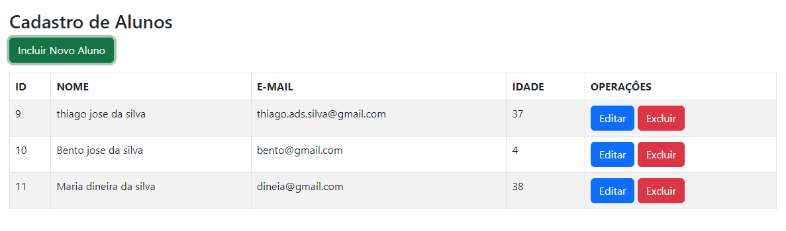
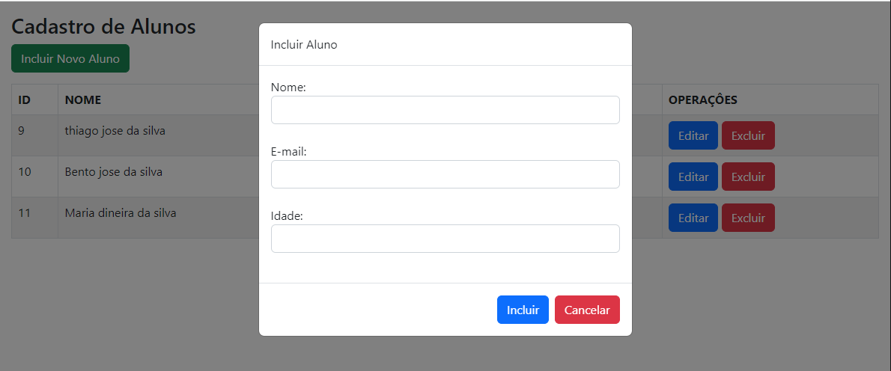
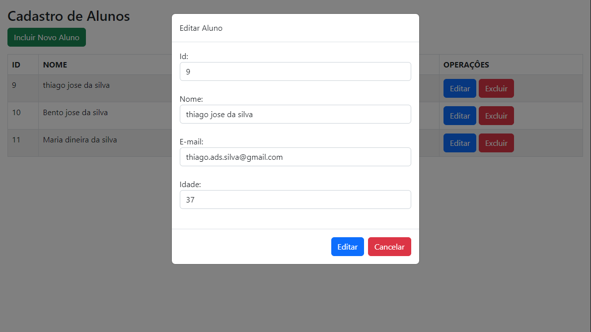
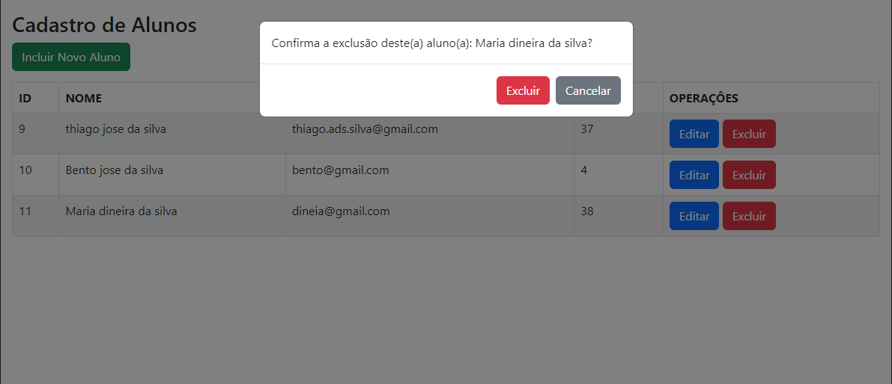

# Projeto - Alunos

### Sistema simples que vai fazer as 4 operações de um CRUD, esse projeto vai consumir uma API desenvolvida em C#

### Link para o repositório da API: https://github.com/thiagoadssilva/UdemyApiAlunoReactj

### Dentro do <b>README</b> da pasta do projeto está tudo que foi ou está sendo usando:

https://github.com/thiagoadssilva/UdemyReactjApiAluno/blob/main/alunosreact/README.md

## Projeto Publicado: ------

## Gif do projeto

## Imagens do projeto

### Listando os Alunos

### Cadastrando os Alunos

### Atualizando os Alunos

### Excluindo os Alunos

